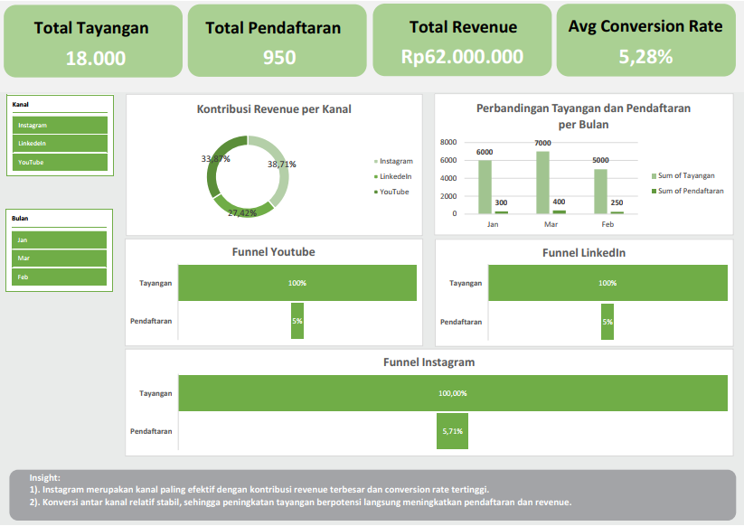

Project Overview: 
This project presents an interactive Excel dashboard created to analyze the digital marketing performance of EcoBuild, a startup promoting sustainable construction training.The dashboard visualizes channel performance and conversion funnel to support better marketing decision making.

Tools & Features Used:
- Microsoft Excel
- Funnel Visualization
- Donut Chart (Channel Contribution)
- KPI Cards (Total Views, Registrations, Revenue)
- Bar Comparison Chart
- Slicer (Filter by Month & Channel)
- Insight Textbox for analysis

Dashboard Preview:

